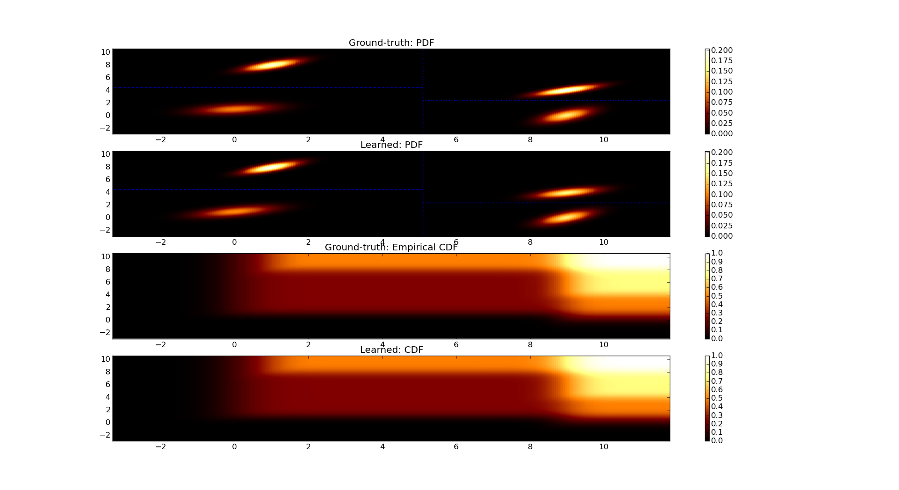
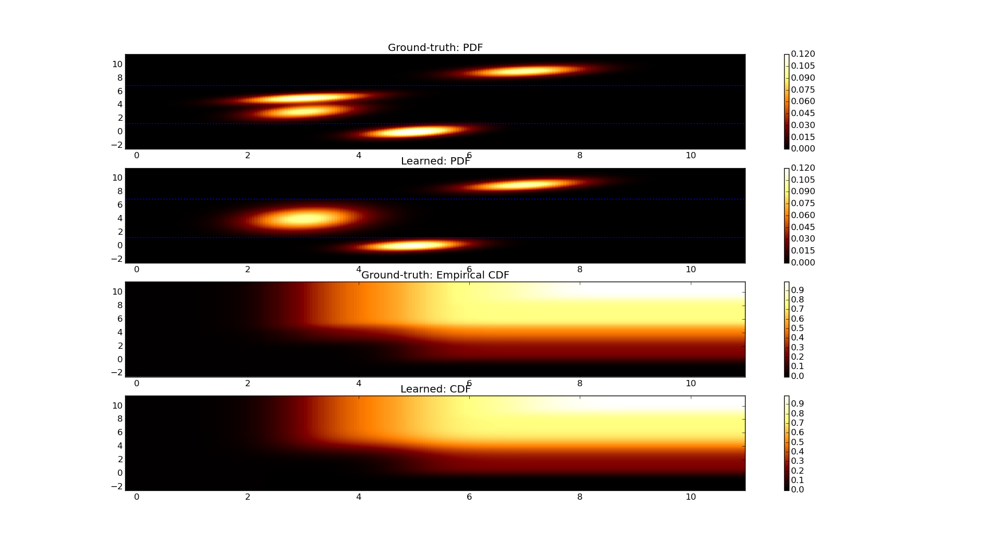

=============================
DensityTree accuracy examples
=============================

All examples were created with the `plot_tree_gauss.py` script shipped with **sklearnef**.

Example 01
==========

Example where the blobs are perfectly separated. The blue lines denote the chosen splits.

.. code-block:: bash

    ./plot_tree_gauss.py --seed=10 --min-improvement=1

Goodness of fit evaluation:

	* maxium error: 0.0157099898541
	* mean squared error: 1.96287068935e-05
	* mean squared error weighted: 1.43077730335e-06

Example 02
==========

Example where two very close blobs where not separated by the DensityTree.

.. code-block:: bash

    ./plot_tree_gauss.py --seed=0 --min-improvement=1

Goodness of fit evaluation:

	* maxium error: 0.037187800654
	* mean squared error: 0.000154910423727
	* mean squared error weighted: 7.67144729963e-06

