==============================================
DensityForest examples (sklearn distributions)
==============================================

DensityForest examples on data distributions from the sklearn library created with the `plot_ensemble_sklearn.py` script shipped with **sklearnef**.

Learning the densities of various distributions
===============================================

Learning the density of various distributions. All examples were generated with ``minimum_improvement=0.1``, only the *blobs* examples used a value of ``0.5``. The integral over the learned density is always 1.0.

.. code-block:: bash

    ./plot_ensemble_sklearn.py {circles_distant,circles_near,moons,blobs,s_curve,swiss_roll} --min-improvement={.1,.5}        

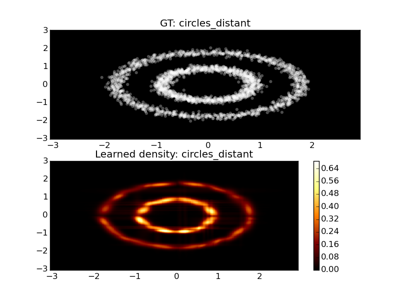

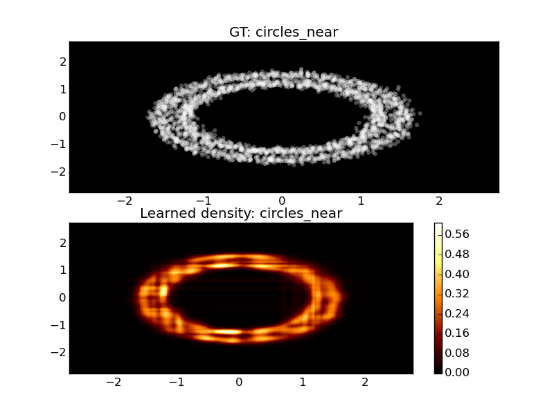
    
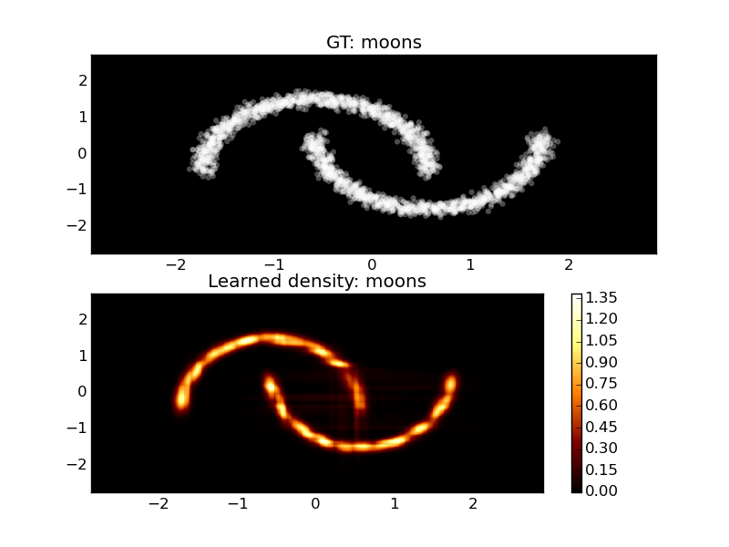
    
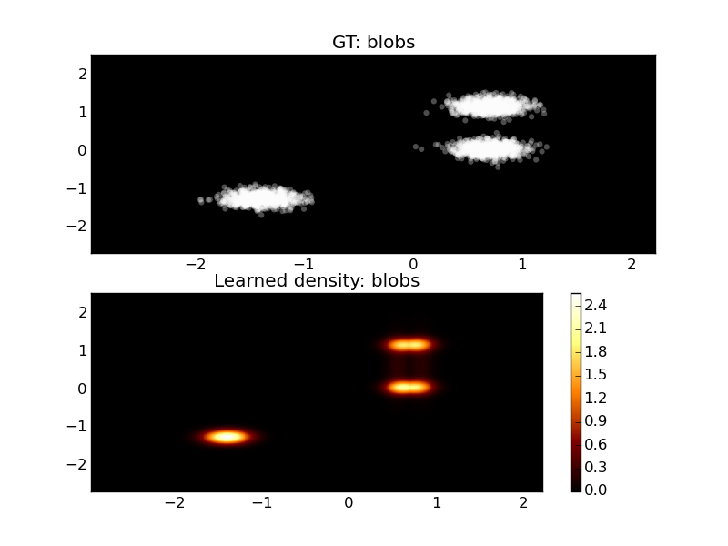
    
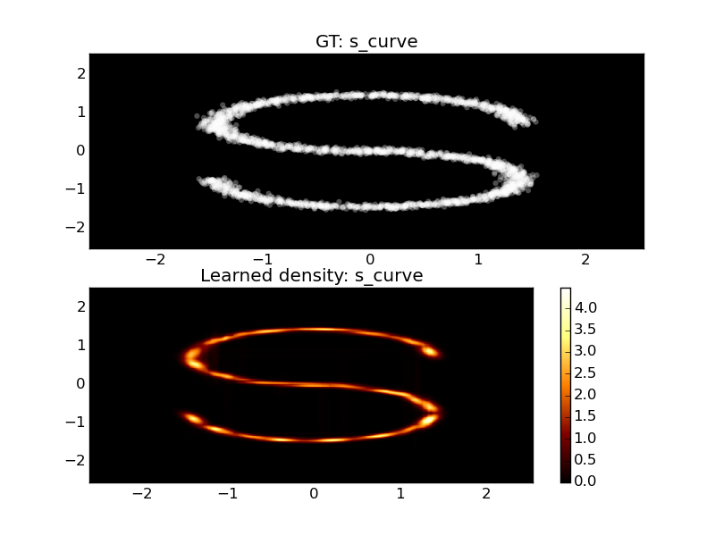
    
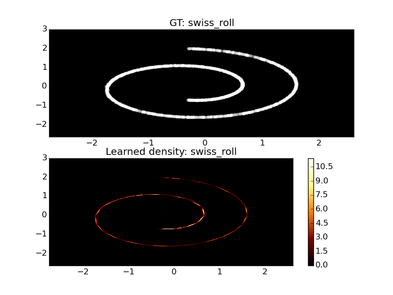

The influence of the ``min_improvement`` parameter
==================================================

The min_improvement parameter, which restricts the tree growth based on the information gain, is the most important lever to train DensityForests. The following examples should give an idea on how it influences the learned distribution.

The first image denotes the training data, i.e. the distribution of the training datapoints whose density distribution we want to learn. The remaining images show the learned distributions for different ``min_improvement`` values: {2.00,1.00,0.50,0.25,0.10,0.05,0.01}. Stopping the tree growth to early fails to capture the finer details, while a too low value fragments the density into many narrow Gaussians.

.. code-block:: bash

    ./plot_ensemble_sklearn.py circles_distant --min-improvement={2.00,1.00,0.50,0.25,0.10,0.05,0.01}

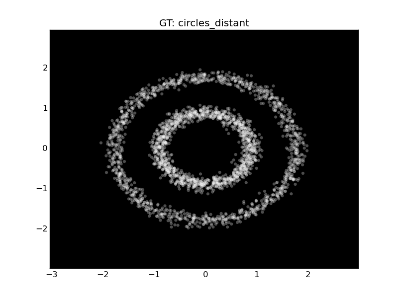

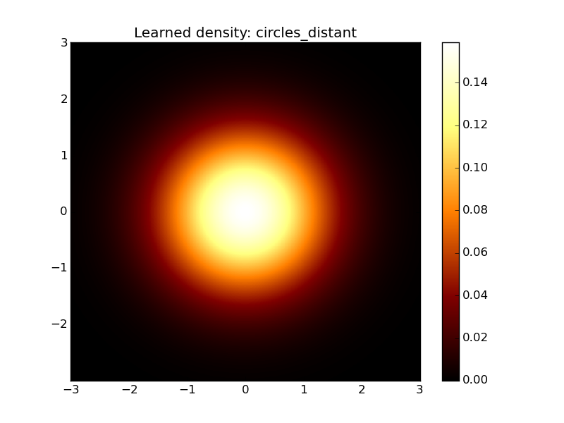
    
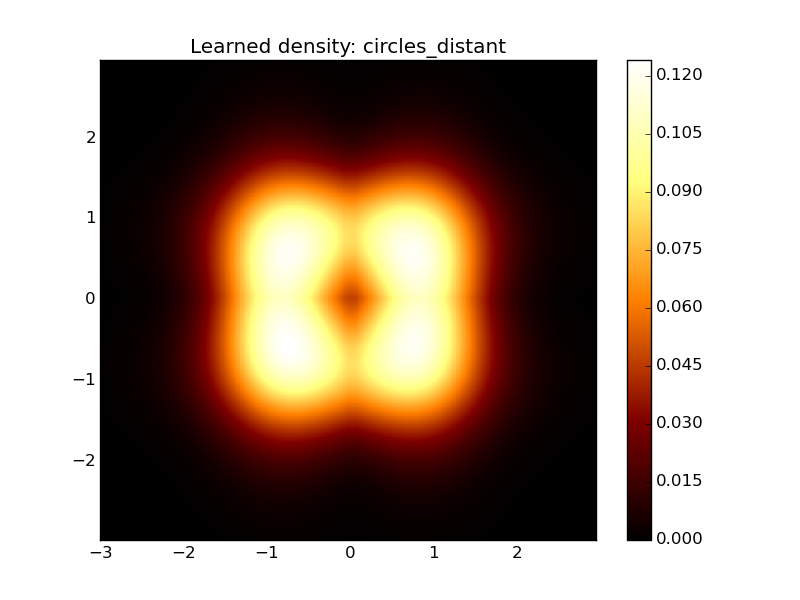
    
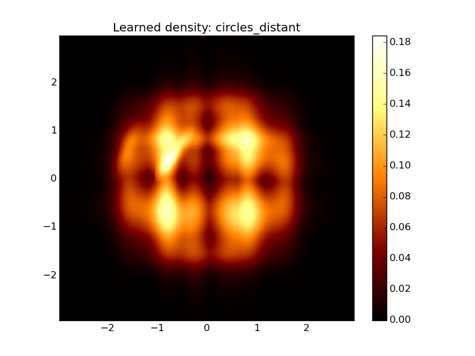
    
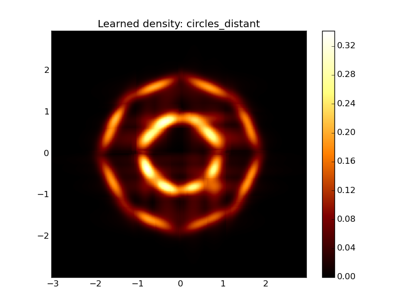
        
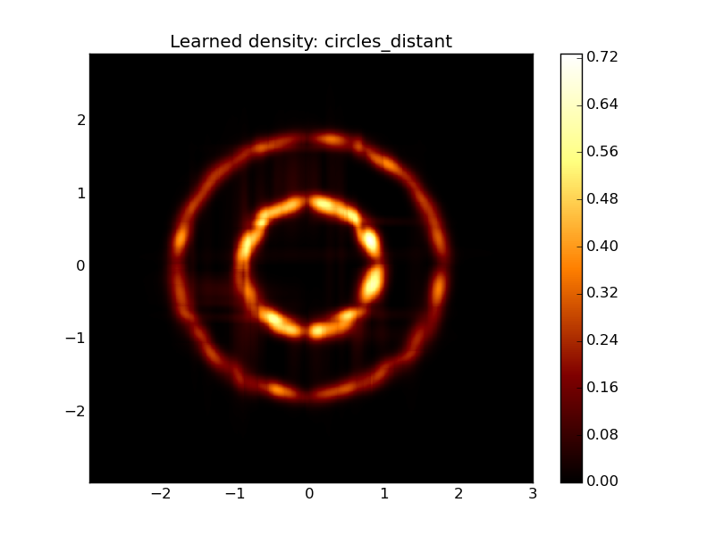
    
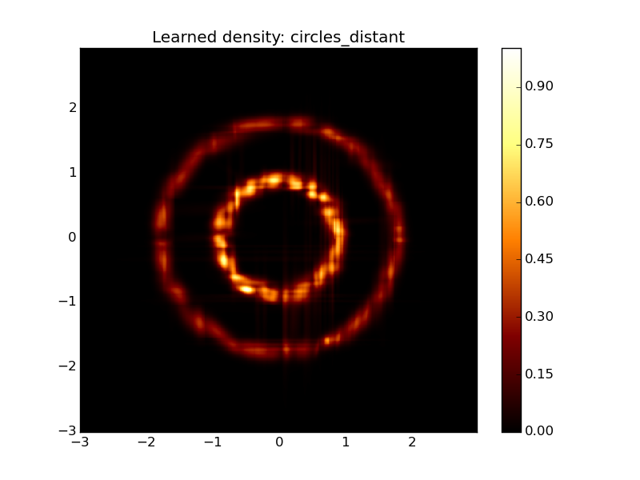
    
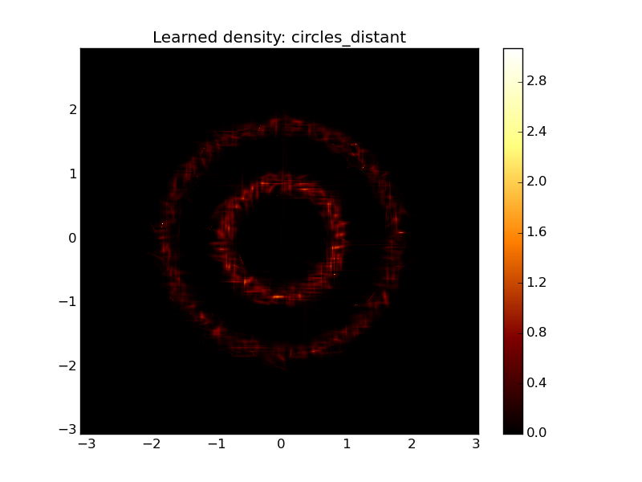

